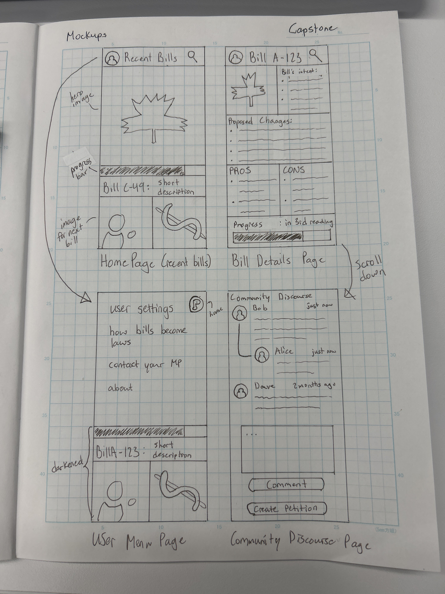

# Project Title

## Overview

Polis is a user-friendly web application designed to empower Canadian citizens by providing clear and concise information about bills currently in the Canadian Parliament. It aims to bridge the gap between complex legislative activities and the average citizen's understanding.

### Problem

Many Canadian citizens feel disconnected from their government's legislative activities due to the complexity of bills and the language used in official sources. Polis addresses this problem by simplifying bill information, making it accessible to a wider audience.

### User Profile

Primary Target Users: Normal Canadian citizens interested in understanding bills in the Canadian Parliament.

User Needs: Users seek easily digestible information about bills to stay informed about current legislative matters.

### Features

- **User Story**: As a Canadian citizen, I want to see a listing of active bills from the Canadian Parliament, so I can stay informed about current legislative matters.
  - **Description**: Users will have access to a comprehensive list of bills currently under consideration in the Canadian Parliament. This list will provide details about the bills, including their titles, sponsors, and status.

- **User Story**: As a concerned citizen, I want to read simple-English descriptions of each bill, including their purpose and potential consequences, to understand their significance.
  - **Description**: Users can click on a specific bill to view a clear and concise description in plain language. These descriptions will explain the bill's objectives, its potential impact on society, and any consequences it may have.

- **User Story**: As an informed citizen, I want to access information on the voting status for each bill, including how the bill is progressing in parliament.
  - **Description**: Users will find a section dedicated to tracking the latest voting status of each bill. It will display the voting status in a progress bar describing the overall parliamentary process, providing transparency into the legislative process.

## Implementation

### Tech Stack

**Frontend**:
- Technologies: HTML, CSS, JavaScript, and React.
- User Interface: Intuitive and accessible design.

**Backend**:
- Server: Node.js and Express.js.
- Data Source: Data will be fetched from the Canadian Parliament's website.
- Integration: A GPT model for generating simple-English descriptions.

### APIs

- [Canadian Parliament Bills Data](https://www.parl.ca/legisinfo/en/bills)
- [Custom GPT API](chat.openai.com)

### Sitemap

- Homepage: Displays the latest bill with a progress bar, a short description, and listings of other bills.
- Bill Details Page: Presents detailed bill information, including a shrunken image, intent, proposed changes, pros, cons, and voting status.
- User Profile: Accessible via a user profile picture, featuring user settings, an explanation of the legislative process, contact information for MPs, and an "about" section.
- Community Discourse (Optional): A discussion section available on the Bill Details Page.

### Mockups



### Data

**Data Sources**:
- Canadian Parliament's Website: Primary source of data.
- Custom GPT Model: Generates plain-language descriptions of bills.

**Data Processing**:
1. Data Retrieval: Custom API fetches the latest data about bills from the Canadian Parliament's website.
2. Data Parsing: Extracts relevant information such as bill descriptions, purposes, consequences, and voting history.
3. GPT Text Generation: Custom GPT model generates plain-language descriptions of bills.
4. Data Presentation: Processed data is presented through the web application's user interface.

### Endpoints

1. **Get List of Active Bills**

   - **Endpoint**: /api/bills
   - **Method**: GET
   - **Parameters**: None
   - **Description**: Retrieves a list of active bills currently in the Canadian Parliament.
   - **Example Response**:

     ```json
     [
       {
         "billID": "C-123",
         "title": "Environmental Protection Act Amendment"
         "sessionID": "33-1"

       },
       {
         "billID": "C-124",
         "title": "Healthcare Reform Bill"
         "sessionID": "33-1"
       }
     ]
     ```

2. **Get Bill Details**

   - **Endpoint**: /api/bills/{billNumber}
   - **Method**: GET
   - **Parameters**: {billNumber}: The unique identifier of the bill to retrieve details for.
   - **Description**: Provides detailed information about a specific bill, including its description, purpose, consequences, and latest votes.
   - **Example Response**:
     ```json
     {
       "billNumber": "C-123",
       "title": "Environmental Protection Act Amendment",
       "status": "In Progress",
       "law": true,
       "introduced": "2001-02-05",
       "legisinfo_url": "https://www.parl.ca/legisinfo/en/bill/9998"
     }
     ```

<!-- 3. **Get Bill Description**
   - **Endpoint**: /api/bills/{billNumber}/description
   - **Method**: GET
   - **Parameters**: {billNumber}: The unique identifier of the bill to retrieve the description for.
   - **Description**: Generates a simplified, easy-to-understand description of a specific bill using the custom GPT model.
   - **Example Response**:
     ```json
     {
       "billNumber": "C-123",
       "title": "Environmental Protection Act Amendment",
       "description": "This bill aims to reduce carbon emissions to combat climate change."
     }
     ```

4. **Get Bill Votes**
   - **Endpoint**: /api/bills/{billNumber}/votes
   - **Method**: GET
   - **Parameters**: {billNumber}: The unique identifier of the bill to retrieve votes for.
   - **Description**: Provides information on the latest votes for a specific bill, including the vote date, result, and voting statistics.
   - **Example Response**:
     ```json
     {
       "billNumber": "C-123",
       "title": "Environmental Protection Act Amendment",
       "latestVotes": [
         {
           "voteDate": "2024-03-15",
           "result": "Passed",
           "votingMembers": 250,
           "votesInFavor": 200,
           "votesAgainst": 50,
           "abstentions": 0
         }
       ]
     } -->
     ```

### Auth

For the MVP (Minimum Viable Product), there will be no authentication or user profile functionality.

## Roadmap

**Sprint 1: January 24 - January 31, 2024 (1 week)**

- **Set Up Development Environment (1 day)**
  - Create a new project repository on a platform like GitHub.
  - Configure your IDE, version control, and project structure.

- **Backend Development - Data Fetching (3 days)**
  - Set up a Node.js and Express.js server.
  - Create endpoints to fetch data from the Canadian Parliament's website.
  - Subtasks:
    - Initialize a Node.js project.
    - Set up Express.js for routing.

- **Initial UI Implementation (3 days)**
  - Implement the basic user interface for listing active bills.
  - Subtasks:
    - Create the bill listing component.
    - Display bill data retrieved from the backend.

**Sprint 2: February 1 - February 4, 2024 (4 days)**

- **GPT Integration (2 days)**
  - Integrate your custom GPT model for generating simple-English descriptions of bills.
  - Subtasks:
    - Set up a dedicated GPT server or API.
    - Implement a communication layer between the frontend and the GPT server.

- **Enhance Bill Details Page (2 days)**
  - Improve the bill details page with descriptions, purposes, consequences, and latest votes.
  - Subtasks:
    - Create the bill details component.
    - Retrieve and display detailed bill information.

**Sprint 3: February 5 - February 7, 2024 (3 days)**

- **User Profile and Location-Based Access (1 day)**
  - Implement user profiles, allowing users to specify their location.
  - Enable access to government representatives' voting records.
  - Subtasks:
    - Create user profile components.
    - Implement location selection functionality.
    - Develop user data storage mechanisms (e.g., JSON storage).

- **Discussion Forums (Nice-to-Have) (1 day)**
  - If time permits, add discussion forums for each bill to promote user engagement and democratic discussions.
  - Subtasks:
    - Design the forum interface.
    - Implement posting and commenting functionality.

- **Final Testing and Bug Fixes (1 day)**
  - Conduct a final round of testing to ensure all features work smoothly.
  - Address any remaining issues or bugs.

## Nice-to-haves

Your project will be marked based on what you committed to in the above document. Under nice-to-haves, you can list any additional features you may complete if you have extra time, or after finishing.

- **User Authentication**: Implement user authentication and profile creation functionality.
- **Location-Based Services**: Allow users to specify their location for access to government representatives' voting records.
- **Discussion Forums**: Implement discussion forums for each bill to promote democratic discussions.
